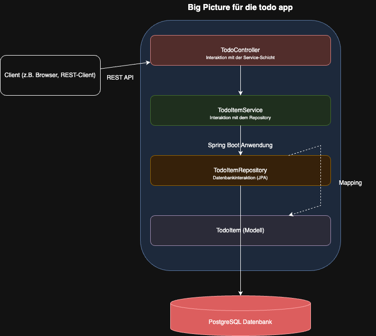
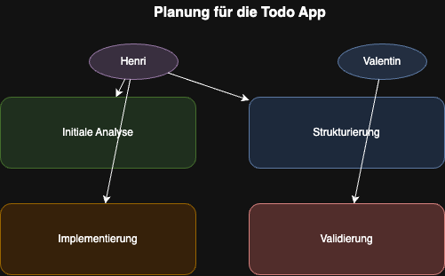
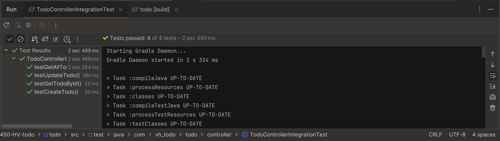
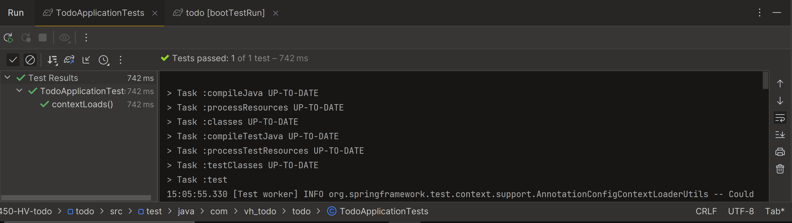
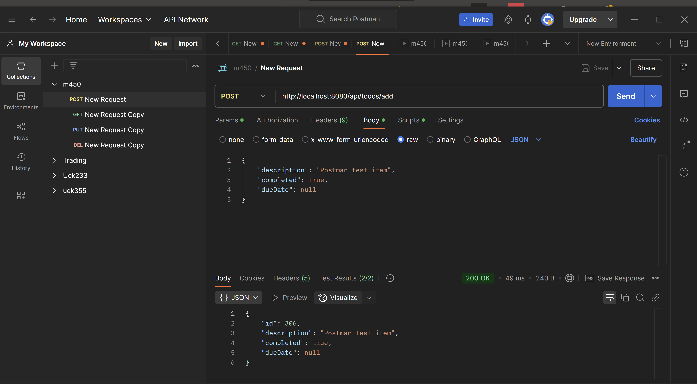
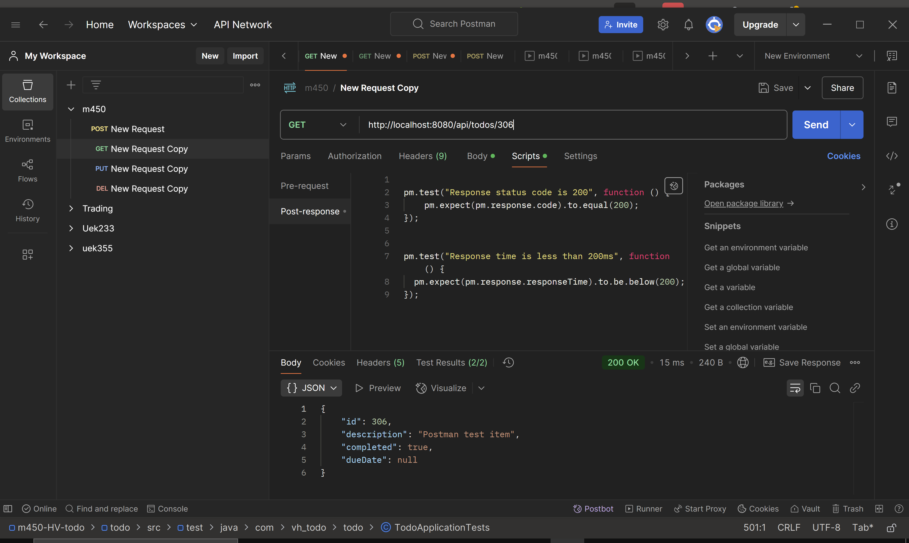
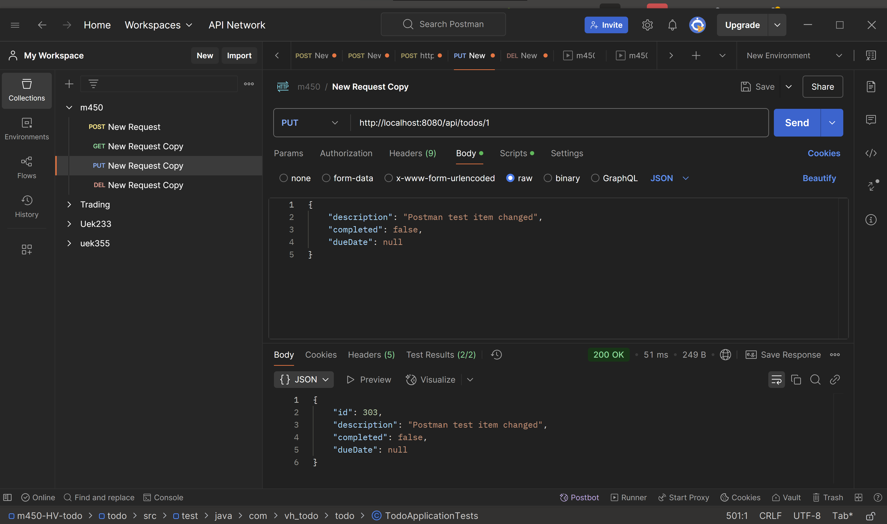
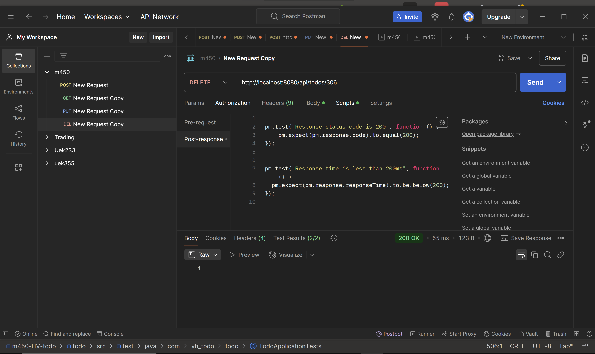

# Welcome to our todo list project

Präsentation: https://docs.google.com/presentation/d/1HHo8Bg_rIJPGrVNUVoRZ2LFwnSsv-xFgqtGz8CknDhs/edit?usp=sharing

# Testkonzept für das Projekt "Spring Boot Todo App"

## Zusammenfassung
Dieses Testkonzept beschreibt die Teststrategie für die "Spring Boot Todo App", eine Anwendung zur Verwaltung von Aufgaben. Ziel ist es, die Qualität der Anwendung durch systematische Tests sicherzustellen.
## Big Picture: Systemarchitektur und Test Items  
   
Die Anwendung basiert auf einer klassischen Spring-Boot-Architektur mit folgenden Komponenten:

- **Model:** Repräsentiert die Datenstruktur (z. B. `TodoItem`-Klasse).
- **Repository:** Schnittstelle zur Datenbank (z. B. `TodoItemRepository`).
- **Service:** Geschäftslogik (z. B. `TodoItemService`).
- **Controller:** Verarbeitet Benutzeranfragen (z. B. `TodoController`).
- **Database:** Datenbank (Dtanebank `docker.yml`).

Test Items:
- Unit-Tests: Model, Repository, Service.
- Integrationstests: Controller.
- End-to-End-Tests: Benutzerinteraktionen über die Endpoints.

## Test Features
Zu testende Features:
- Erstellung, Bearbeitung und Löschung von Aufgaben.
- Performance mittels Postman.

## Features, die nicht getestet werden
Nicht getestet werden:
- Styling und Layout der UI (wird als "Nice-to-Have" betrachtet).

## Testvorgehen
Da das Projekt nach dem TDD-Ansatz umgesetzt wird, erfolgt die Testentwicklung in drei Schritten:
1. **Schreiben eines fehlgeschlagenen Tests:** Definieren eines Tests für ein gewünschtes Verhalten.
2. **Implementieren der minimalen Funktionalität:** Schreiben von Code, der den Test besteht.
3. **Refaktorieren:** Optimieren des Codes, ohne die Funktionalität zu verändern.

## Kriterien für erfolgreiche/nicht-erfolgreiche Tests
Ein Test gilt als erfolgreich, wenn:
- Die erwarteten Ergebnisse mit den tatsächlichen übereinstimmen.
- Keine unerwarteten Fehler auftreten.

Ein Test gilt als nicht erfolgreich, wenn:
- Die Anwendung unerwartetes Verhalten zeigt.
- Eingaben nicht validiert werden.

## Testumgebung
- **Programmiersprache:** Java
- **Test-Frameworks:**
  - JUnit 5 für Unit- und Integrationstests
  - Mockito für Mocking
  - Spring Boot Test für Integrationstests
- **Datenbank:** 
- **Tools für End-to-End-Tests:**
  - Postman
- **Build-Tool:** Gradle

## Kurze Planung

 

   

# CI Pipeline

Diese GitHub-Actions-Pipeline baut das Projekt in einer Docker-basierten Umgebung, sobald Code in irgendeinem Branch gepusht oder ein Pull Request geöffnet wird (oder wenn die Pipeline manuell gestartet wird). Zunächst wird der aktuelle Code aus dem Repository geholt und Docker Compose installiert. Anschließend werden über Docker Compose alle benötigten Dienste (beispielsweise die Datenbank) hochgefahren und es wird einige Sekunden gewartet, damit sie einsatzbereit sind. Danach richtet die Pipeline Java 23 ein, macht das Gradle-Skript ausführbar und führt den Befehl „./gradlew clean build“ aus, um das Projekt zu kompilieren und zu testen. Zum Schluss werden alle über Docker Compose gestarteten Dienste wieder heruntergefahren, sodass keine Container zurückbleiben.

# Code Review

Beim Code Review ist mir aufgefallen, dass noch viele Kommentare fehlten, die für ein solches Projekt essenziell sind. Valentin hat sich dieser Aufgabe angenommen und die fehlenden Kommentare ergänzt.

Am eigentlichen Code konnte ich keine Fehler feststellen, sodass hier keine weiteren Verbesserungen nötig waren. Wir haben uns gegenseitig regelmäßig kontrolliert, indem wir vor jedem Pull die Commits der jeweils anderen Person überprüft haben.

Da wir auch in unserer Firma regelmäßig Code Reviews durchführen, war dieser Prozess für uns nichts Neues oder besonders Herausforderndes

# TDD (Test Driven Development)
Wir haben Test-Driven Development (TDD) in unserem Projekt ausprobiert, indem wir ein neues Feature hinzugefügt haben. Dafür haben wir einen separaten Branch verwendet, den sogenannten feature-shorten-due-date-Branch. Nach unseren Erfahrungen können wir nun nachvollziehen, warum diese Methode häufig eingesetzt wird.

TDD hilft dabei, Funktionen im Voraus deutlich besser zu planen, da man bereits vor der Implementierung festlegt, welche Ergebnisse die Funktion liefern soll. Dadurch wird sichergestellt, dass am Ende keine ungenauen oder unfertigen Funktionen entstehen.

Trotzdem bevorzugen wir aktuell die normale Methode der Code-Entwicklung. Dies liegt vermutlich daran, dass es Zeit und Übung benötigt, um sich an die TDD-Methodik zu gewöhnen. Allgemein sind wir aber positiv überrascht von dieser Methode.

# Test Rapport

## Unit Tests
   

## Integration Tests
   

## Context Load Tests
   

## Postman Tests

### Post
   

### Get
   

### Put
   

### Del
   
